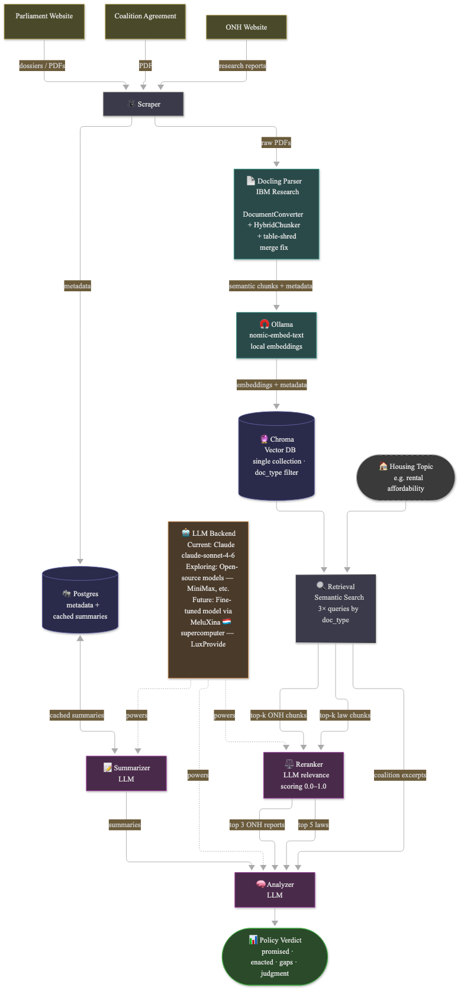

# LuxDem

LuxDem analyzes Luxembourg housing policy. It scrapes legislative dossiers from [chd.lu](https://www.chd.lu) and publications from ONH (Observatoire National de l'Habitat), embeds them into a vector store, and uses an LLM to cross-reference laws against the governing coalition's agreement and ONH's research — producing a structured verdict: what was promised, what was enacted, and what's missing.



## Pipeline

1. **Scrape** — fetch dossier and ONH metadata, store in Postgres.
2. **Parse** — parse PDFs with [Docling](https://github.com/docling-project/docling), chunk into semantically meaningful pieces.
3. **Embed** — embed chunks locally with Ollama (`nomic-embed-text`), store in Chroma.
4. **Summarize / Rerank** — an LLM summarizes each document and scores its relevance to a topic.
5. **Analyze** — an LLM produces a structured verdict, cross-referencing coalition commitments against enacted laws and ONH research.

## Running locally

The app is two Docker services sharing one image: a FastAPI backend (`luxdem_backend`) and a Dash frontend (`luxdem-frontend`). Both need Postgres and a Docker network provided by [`luxdem-infra`](https://github.com/AmaurySalles/luxdem-infra) — start that first.

```bash
# One-time: install pre-commit hooks
make setup

# Build the dev image
make dev-build

# Start the app (requires luxdem-infra running)
docker compose -f docker-compose.yml -f docker-compose.override.yml up -d
```

Backend: `localhost:8000`. Frontend: `localhost:8050`.

Config lives in `config/<environment>.yaml` (committed) and `secrets/<environment>.yaml` (gitignored, overrides config). See `.claude/DECISIONS.md` for why they're split this way.

## Commands

```bash
# Run the test suite
make all-tests

# Data pipelines (Typer CLI, run inside the backend container)
docker exec luxdem_backend python3 -m app.typer_app --help
docker exec luxdem_backend python3 -m app.typer_app scrape-onh-command
docker exec luxdem_backend python3 -m app.typer_app embed-onh-command
docker exec luxdem_backend python3 -m app.typer_app analyze-topic-command "logement abordable"

# Logs
docker logs luxdem_backend --tail=100 -f
```

## Contributing

See [CONTRIBUTING.md](CONTRIBUTING.md). Architecture and coding conventions are documented in `CLAUDE.md` and `.claude/`.

## License

MIT — see [LICENSE.md](LICENSE.md).
